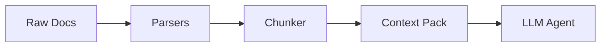

# AgentPack

**AgentPack** improves the context pipeline for document-grounded agents.

Instead of forcing AI agents to parse messy, disparate file formats (PDFs, CSVs, Markdown, text) at runtime, AgentPack is an offline **document-to-agent-context compiler**. It takes unstructured knowledge bases, turns them into clean semantic chunks with citations, retrieves the right evidence, and sends only high-signal context to the model.

## The V1 Claim
**Given the same LLM, AgentPack provides better context than raw document stuffing or naive RAG.**

We recently benchmarked AgentPack against standard RAG baselines on 42 complex financial queries from [Patronus AI FinanceBench](https://github.com/patronus-ai/financebench). The results prove that AgentPack reduces context bloat, improves evidence retrieval, preserves citations, and helps the exact same LLM produce more grounded answers.

**Benchmark Highlights:**
* **161x Reduction in Token Cost:** Cut context token usage from 424k to 2.6k, saving ~$0.10 per query.
* **2x Context Relevance:** Vastly outperformed naive chunking in retrieving semantically complete financial tables.
* **"Lost in the Middle" Prevention:** Outperformed raw document stuffing in correctness by preventing the LLM from drowning in noise.

Read the full scientific methodology and results in [BENCHMARK.md](./BENCHMARK.md).

## Installation

```bash
git clone https://github.com/yourusername/agentpack.git
cd agentpack
python3 -m venv venv
source venv/bin/activate
pip install -e .
```

## Quick Start

### 1. Scan for Secrets (Recommended)
Before compiling a pack, ensure you aren't accidentally leaking API keys or secrets into the LLM context window. AgentPack automatically installs Yelp's `detect-secrets`.
```bash
detect-secrets scan > .secrets.baseline
```

### 2. Compile a Pack
Point AgentPack at any folder containing your documents (`.txt`, `.md`, `.csv`, `.pdf`).

```bash
agentpack pack ./my_docs --out ./agentpack-output
```

**Key Compilation Options:**
- `--include "*.md,*.txt"`: Only pack specific files or extensions.
- `--ignore "tests/,drafts/"`: Exclude specific directories or files.
- `--remove-empty-lines`: Compress text files to save LLM tokens.
- `--no-gitignore`: Ignore `.gitignore` rules and pack everything.

### 2. Retrieve
AgentPack comes with a built-in hybrid search engine (SQLite FTS5 + FastEmbed vector search) to test your chunks instantly.

```bash
agentpack retrieve ./agentpack-output "eligibility criteria" --top-k 5
```

### 3. V1 Deterministic Eval
Benchmark AgentPack against naive chunking using our offline evaluation harness.

```bash
agentpack eval ./benchmarks/my_dataset
```

## Comprehensive CLI Documentation

AgentPack provides a rich CLI for auditing, validating, and testing your context packs (including Generative QA evaluations). 

**[📖 Read the full CLI Reference](./docs/cli-reference.md)**

## Supported Parsers
- **TXT**: Paragraph-aware splitting.
- **Markdown**: Semantic heading-aware section path tracking.
- **CSV**: Uses Pandas & Tabulate to convert tabular data into Markdown tables.
- **PDF**: Accurate page-by-page PyMuPDF extraction.

## Architecture Overview



For a deep dive into how AgentPack parses, chunks, and indexes data, see [Architecture & Internals](./docs/architecture.md).

---
*Built with ❤️ for Agents.*
