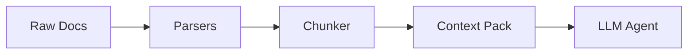

# AgentPack

**AgentPack** improves the context pipeline for document-grounded agents.

Instead of forcing AI agents to parse messy, disparate file formats (PDFs, CSVs, Markdown, text) at runtime, AgentPack is an offline **document-to-agent-context compiler**. It takes unstructured knowledge bases, turns them into clean semantic chunks with citations, retrieves the right evidence, and sends only high-signal context to the model.

## The Benchmark
**Given the same LLM, AgentPack provides better context than raw document stuffing or naive RAG.**

I benchmarked AgentPack against standard RAG baselines on 42 complex financial queries from [Patronus AI FinanceBench](https://github.com/patronus-ai/financebench). The results prove that AgentPack reduces context bloat, improves evidence retrieval, preserves citations, and helps the exact same LLM produce more grounded answers.

**Benchmark Highlights:**
* **161x Reduction in Token Cost:** Cut context token usage from 424k to 2.6k, saving ~$0.10 per query.
* **2x Context Relevance:** Vastly outperformed naive chunking in retrieving semantically complete financial tables.
* **"Lost in the Middle" Prevention:** Outperformed raw document stuffing in correctness by preventing the LLM from drowning in noise.

AgentPack is best treated as an offline document-to-agent-context compiler. It reduces context bloat, but a strong reasoning model is still required to solve complex queries.

| Signal | What good looks like |
|--------|----------------------|
| **Token reduction** | ~161x reduction (99% smaller) compared to raw document stuffing |
| **Context per query** | Averages ~2.6k high-signal tokens per retrieval (vs 400k+ for raw files) |
| **Context Relevance** | ~2x more relevant than naive chunking; preserves tabular and semantic boundaries |
| **Cost Savings** | Drops LLM input cost per query from ~$0.11 to <$0.0007 |
| **Noise Prevention** | Prevents the "Lost in the Middle" phenomenon; higher correctness despite less text |
| **The Bottleneck** | AgentPack provides the context, but you still need a frontier model to perform the final reasoning |

*Use deterministic, LLM-as-a-judge evals instead of trusting raw compression numbers.*

Read the full scientific methodology and results in [BENCHMARK.md](https://github.com/Vedant1202/agentpack/blob/main/BENCHMARK.md).

## Installation

You can install AgentPack via pip or npm. To use the new interactive Corpus Explorer UI, you must install the `[ui]` extra dependencies.

**Option 1: Using pip (Python)**
```bash
# Core only
pip install agent-context-packager

# With Corpus Explorer UI
pip install "agent-context-packager[ui]"
```

**Option 2: Using npm (Node.js/CLI binary)**
```bash
npm install -g agent-context-packager
```

**Option 3: From Source**
```bash
git clone https://github.com/Vedant1202/agentpack.git
cd agentpack
python3 -m venv venv
source venv/bin/activate
pip install -e .
```

## Quick Start

### 1. Scan for Secrets (Recommended)
Before compiling a pack, ensure you aren't accidentally leaking API keys or secrets into the LLM context window. AgentPack automatically installs Yelp's `detect-secrets`.
```bash
detect-secrets scan > .secrets.baseline
```

### 2. Compile a Pack
Point AgentPack at any folder containing your documents (`.txt`, `.md`, `.csv`, `.pdf`).

```bash
agentpack pack ./my_docs --out ./agentpack-output
```

**Key Compilation Options:**
- `--include "*.md,*.txt"`: Only pack specific files or extensions.
- `--ignore "tests/,drafts/"`: Exclude specific directories or files.
- `--remove-empty-lines`: Compress text files to save LLM tokens.
- `--no-gitignore`: Ignore `.gitignore` rules and pack everything.

### 2. Retrieve
AgentPack comes with a built-in hybrid search engine (SQLite FTS5 + FastEmbed vector search) to test your chunks instantly.

```bash
agentpack retrieve ./agentpack-output "eligibility criteria" --top-k 5
```

### 3. V1 Deterministic Eval
Benchmark AgentPack against naive chunking using our offline evaluation harness.

```bash
agentpack eval ./benchmarks/my_dataset
```

### 4. Visualize with the Corpus Explorer
If you installed AgentPack with the `[ui]` extra, you can launch a local WebGL-powered 2D physics visualization of your compiled chunks. This allows you to visually debug chunk sizes, semantic similarities, and hybrid search trajectories.

```bash
agentpack ui ./agentpack-output --port 8000
```
**[🖼️ Read the full UI breakdown](https://github.com/Vedant1202/agentpack/blob/main/docs/corpus-explorer-ui.md)**

## Comprehensive CLI Documentation

AgentPack provides a rich CLI for auditing, validating, and testing your context packs (including Generative QA evaluations). 

**[📖 Read the full CLI Reference](https://github.com/Vedant1202/agentpack/blob/main/docs/cli-reference.md)**

## Supported Parsers
- **TXT**: Paragraph-aware splitting.
- **Markdown**: Semantic heading-aware section path tracking.
- **CSV**: Uses Pandas & Tabulate to convert tabular data into Markdown tables.
- **PDF**: Accurate page-by-page PyMuPDF extraction.

## Architecture Overview



For a deep dive into how AgentPack parses, chunks, and indexes data, see [Architecture & Internals](https://github.com/Vedant1202/agentpack/blob/main/docs/architecture.md).

## Current Limitations & Roadmap
AgentPack is currently focused on text-based semantic extraction. The following features are on the roadmap but **not yet implemented**:
- **Image Understanding / Vision**: AgentPack does not currently run OCR or vision models on images embedded within PDFs or Markdown files. Images are currently ignored during the parsing phase.
- **Complex Table Structures**: While basic CSVs are supported, highly nested or merged-cell tables within PDFs are not perfectly reconstructed yet.
- **Web Crawling**: You currently need to provide local files. Direct URL scraping is planned.
- **Cloud Vector DB Integration**: Retrieval currently runs locally using SQLite FTS5 and FastEmbed. Connectors for Pinecone, Weaviate, or Qdrant are planned.

---
*Built with ❤️ for Agents.*
