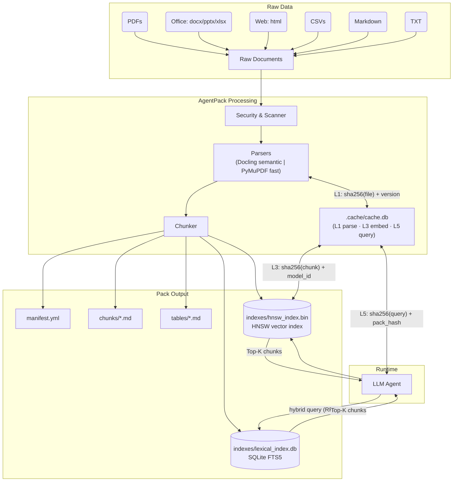

# AgentPack Architecture

AgentPack acts as a bridge between raw, unstructured knowledge and LLM-powered agents. It performs the heavy lifting of parsing, chunking, and indexing offline, so agents receive clean, high-signal context.

## High-Level Data Flow



## The Context Pack

When you run `agentpack pack`, it generates a directory structure known as a **Context Pack**.

```text
agentpack-output/
├── manifest.yml           # Registry: sources, chunks, tables, citations, pack version.
├── chunks/                # Agent-ready markdown files (one per chunk).
├── tables/                # Extracted tables in standalone Markdown format.
├── indexes/               # FTS and vector indexes.
│   ├── lexical_index.db   # SQLite FTS5 full-text search index.
│   ├── vector_index.npy   # Pre-normalized dense vectors (float32).
│   ├── vector_meta.json   # Per-vector chunk metadata.
│   ├── hnsw_index.bin     # HNSW approximate nearest-neighbour index.
│   └── vector_index.hash  # Content hash for invalidation.
├── .cache/
│   └── cache.db           # Content-addressed cache (L1/L3/L5 layers).
└── reports/               # Audit and validation reports.
```

### `manifest.yml`
The registry for the pack. Maps original document sources to their chunks and maintains citation metadata (source path, page number, section) so every piece of text sent to an agent can be traced back to its origin. The `version` field reflects the installed package version.

### Security & Scanning Layer
Before parsing, AgentPack acts as a firewall against context bloat and secret leakage:
1. **Filtering Engine:** Uses `pathspec` to respect `.gitignore` and `.agentpackignore` rules, ensuring irrelevant files (like `node_modules/` or test suites) never reach the LLM. Hidden directories are excluded by default.
2. **Secret Detection:** AgentPack ships with `detect-secrets`. Run `detect-secrets scan > .secrets.baseline` before packing to prevent API keys and passwords from entering the final context window.

### Parsers
AgentPack uses two parsing modes, selected per file type:

**Semantic mode (default):**
- **PDF**: Docling structured-tree parse — preserves page numbers, section hierarchy, and extracts `type="table"` blocks. Headings, paragraphs, and tables are emitted as distinct `DocumentBlock`s.
- **Office / Web** (`.docx`, `.pptx`, `.xlsx`, `.html`): Docling via the same structured-tree path.
- `DocumentConverter` is loaded once per process (singleton) to avoid repeated model initialization.

**Fast mode (`--fast`):**
- **PDF**: PyMuPDF spatial extraction — page-by-page text, faster but no semantic structure.
- Use `--fast` for quick iteration on small corpora where parse speed matters more than fidelity.

**Always:**
- **Markdown**: Tracks semantic headings (`# H1 → ## H2`) so chunks retain hierarchical `section_path`.
- **CSV**: Pandas + Tabulate converts tabular data into Markdown tables.
- **TXT**: Paragraph-aware splitting.

### Chunker
Blocks are tokenized with `tiktoken` (`cl100k_base`) and accumulated into chunks up to `max_tokens` (default 800) with configurable overlap (default 15%). Blocks that exceed `max_tokens` on their own are **split internally** with overlap, preserving `page` and `section` metadata on every sub-block.

### Content-Addressed Cache

Re-runs pay only for what changed. Three cache layers are stored in `.cache/cache.db`:

| Layer | Key | What's cached |
|---|---|---|
| L1 Parse | `sha256(file_bytes) + parser_version + fast_flag` | Serialized `SourceDocument` — skips Docling on unchanged files |
| L3 Embed | `sha256(chunk_text) + model_id` | Embedding vector — unchanged chunks are never re-embedded |
| L5 Query | `sha256(query + mode + top_k + filters + pack_hash)` | Result set — repeated queries served without re-searching |

Keys carry a version component so a logic change auto-invalidates only the affected layer.

### Indexing
Instead of forcing agents to process thousands of tokens for every query, AgentPack creates dual indexes for lightning-fast retrieval:

- **Lexical Index (SQLite FTS5)**: Full-text search optimized for keyword matching. Queries are OR-of-terms by default.
- **Vector Index (FastEmbed + HNSW)**: `BAAI/bge-small-en-v1.5` ONNX embeddings via FastEmbed; stored as pre-normalized float32 vectors. The default backend is **HNSW** (`hnswlib`, inner-product space = cosine on normalized vectors). Falls back to brute-force `np.dot` when `hnswlib` is absent or for very small corpora.
- **Hybrid Search (default)**: Combines lexical and vector rank lists using **Reciprocal Rank Fusion** (`score = 1 / (60 + rank)`) — rank-stable across heterogeneous score scales.

### Index Invalidation
Both indexes store a content hash (SHA-256 of sorted chunk IDs + source checksums) at build time. Before every query, the stored hash is compared against the current manifest. A mismatch triggers an automatic rebuild — re-packing a corpus never silently serves stale results.
