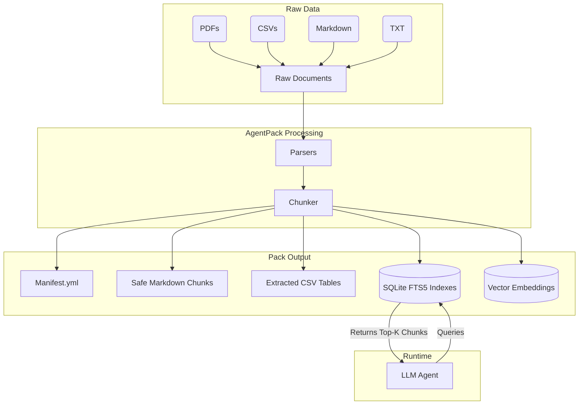

# AgentPack Architecture

AgentPack acts as a bridge between raw, unstructured knowledge and LLM-powered agents. It performs the heavy lifting of parsing, chunking, and indexing offline, so agents receive clean, high-signal context.

## High-Level Data Flow



## The Context Pack

When you run `agentpack pack`, it generates a directory structure known as a **Context Pack**.

```text
agentpack-output/
├── manifest.yml           # The brain of the pack. Contains schema, sources, chunks.
├── chunks/                # Safe, agent-ready markdown files.
├── tables/                # Extracted CSV tables in standalone format.
├── indexes/               # Cached SQLite FTS5 lexical indexes.
└── reports/               # Generated audit and validation reports.
```

### `manifest.yml`
This is the core of the pack. It acts as the registry for all processed files. It maps original document sources to their resulting chunks and maintains citation metadata, ensuring that every piece of text sent to an agent can be traced back to its origin.

### Parsers
AgentPack uses specialized parsers for different file types to ensure maximum fidelity:
- **TXT**: Uses paragraph-aware splitting to prevent cutting sentences in half.
- **Markdown**: Tracks semantic headings (e.g., `# Header -> ## Subheader`) so chunks retain hierarchical context.
- **CSV**: Uses Pandas and Tabulate to convert raw tabular data into pristine, readable Markdown tables.
- **PDF**: Uses PyMuPDF for accurate page-by-page text extraction.

### Indexing
Instead of forcing agents to process thousands of tokens for every query, AgentPack creates dual indexes for lightning-fast retrieval:
- **Lexical Index (SQLite FTS5)**: A Full-Text Search index optimized for exact keyword matching and fast lexical lookups.
- **Vector Index (FastEmbed + NumPy)**: Generates dense vector embeddings for semantic search, capturing the underlying meaning of the text.
- **Hybrid Search**: By default, retrieval combines both lexical and vector scores, allowing agents to retrieve exactly the evidence they need with sub-second latency and high semantic accuracy.
