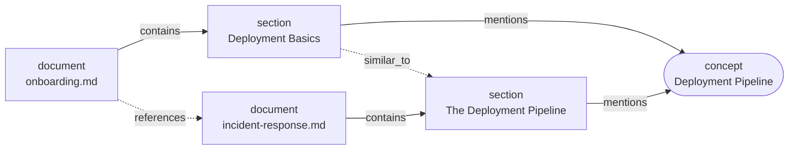

# Corpus Concept Graph (`graph.yml`)

Alongside `manifest.yml` and `map.yml`, a pack emits **`graph.yml`** — a graph of how documents in the corpus relate to *each other*. Where `map.yml` answers "what is inside this document?", `graph.yml` answers **"what does this corpus have in common, and what is disconnected from everything else?"**

It is generated by default during `agentpack pack` (disable with `--no-graph`).

## Why a graph?

`map.yml` is a tree, and a tree has one root per document. That shape can describe a single document perfectly and still tell you nothing about the corpus as a whole. Questions that need edges *between* documents have nowhere to live:

- Which topics recur across many documents, rather than appearing once?
- Which documents actually reference each other?
- Which document is connected to nothing — either off-topic, or a gap where the connecting document is missing?
- Which topics act as bridges between otherwise-separate clusters of the corpus?

`graph.yml` encodes exactly those relationships, and nothing else. It is built entirely from artifacts the pack already produced, so it adds no parsing and no network calls.

## The model at a glance

Three node kinds, four edge relations:



| Node kind | Id comes from | Meaning |
|---|---|---|
| `document` | `manifest.yml` `sources[].id` | One packed source file. Every source gets a node, including ones that failed to parse. |
| `section` | `map.yml` `node_id` | A section that carries at least one edge. |
| `concept` | `c_<slug>` (new namespace) | A keyphrase that recurred across enough documents to be promoted. |

| Edge | Direction | `basis` | Built from |
|---|---|---|---|
| `contains` | document → section | `structural` | The `map.yml` tree. |
| `mentions` | section → concept | `keyphrase` | Promoted YAKE keyphrases. |
| `references` | document → document | `structural` | Markdown links between packed files. |
| `similar_to` | section ↔ section | `embedding` | Section-centroid cosine similarity, at index time only. |

Nodes reuse the ids that already exist — a `document` node **is** the manifest's `source_id`, a `section` node **is** the map's `node_id`. Only concepts introduce new ids. That means a graph node can be resolved against the other two files without a lookup table.

## A worked example

Four short Markdown files about an engineering org (`onboarding.md`, `incident-response.md`, `api-gateway.md`, `alerting.md`). Packing them produces:

```yaml
graph_version: 1
pack: { name: docs_example_corpus, generated_at: ..., manifest: manifest.yml }
params:
  enabled: true
  df_cap: 0.30
  min_docs: 2
  similarity_threshold: 0.80
nodes:
- { id: c_alerting_system,     kind: concept,  label: alerting system,     doc: null,    community: 0 }
- { id: c_deployment_pipeline, kind: concept,  label: Deployment Pipeline, doc: null,    community: 2 }
- { id: src_003,               kind: document, label: onboarding.md,       doc: null,    community: 1 }
- { id: src_003_s00-01,        kind: section,  label: Deployment Basics,   doc: src_003, community: 2 }
  # ... 11 more nodes
edges:
- { source: src_003,        target: src_003_s00-01,      relation: contains,   basis: structural }
- { source: src_003_s00-01, target: c_deployment_pipeline, relation: mentions, basis: keyphrase }
- { source: src_003,        target: src_001,             relation: references, basis: structural }
  # ... 8 more edges
communities:
- { id: 0, label: alerting system,     size: 4 }
- { id: 2, label: Deployment Pipeline, size: 3 }
  # ... 3 more
```

Two concepts were promoted. `alerting system` is mentioned by three sections spread across three different documents; `Deployment Pipeline` by two sections in two documents. The mutual Markdown links between `onboarding.md` and `incident-response.md` became `references` edges in both directions.

### Why "API gateway" is *not* a concept

The corpus talks about the API gateway constantly, and it still did not promote. That is the gates working, and it is worth walking through because it is the most common source of "why isn't my obvious topic here?"

| Gate | Value | Passes? |
|---|---|---|
| Document frequency (`df_cap`) | Appears in 4 of 16 sections = **0.25**, under the 0.30 cap | Yes |
| Distinct documents (`min_docs`) | 3 occurrences in `api-gateway.md`, 1 in `onboarding.md` | **No** — see below |
| Length / not-numeric | `api_gateway`, 11 chars | Yes |

`api-gateway.md`'s own title is *"API Gateway Architecture"*. A document repeating its own name is not evidence that a topic spans the corpus, so those three occurrences are excluded as **self-reference**. That leaves one document, below `min_docs = 2`, so no concept.

This is intentional: without the filter, every document in a corpus of company filings would promote its own company name, and every README its own project name. To promote it anyway, either lower `min_docs` to `1` or rename the file so its title stops matching.

## Concept promotion

A keyphrase from `map.yml` becomes a concept only if it clears **all three** gates:

1. **`min_docs`** (default `2`) — appears in sections from at least this many *distinct* documents. A phrase repeated twenty times in one document is that document's topic, not the corpus's.
2. **`df_cap`** (default `0.30`) — appears in at most this fraction of *all* sections in the pack. A phrase in most sections is boilerplate (a page header, a footer, a recurring disclaimer), not a distinguishing topic.
3. **Length** — at least 4 characters and not purely numeric, which drops fragments like `q3` and `2024`.

Two normalizations run before the gates:

- **Slug merging.** Keyphrases are normalized to a slug (casefolded, non-word runs collapsed to `_`), so `Balance Sheet` and `balance-sheet` are one concept. Slugs that differ only in **word order or repetition** are also merged — YAKE emits overlapping windows over a repeated phrase, producing `FISCAL YEAR`, `Fiscal Year Fiscal`, and `Year Fiscal Year` for a single idea. These count as one concept's evidence rather than three weaker candidates.
- **Self-title filtering.** A keyphrase that reduces to nothing but the document's own title (plus optionally a generic corporate suffix like *Inc.* or *Corp.*) is excluded **for that document only**. A genuine mention of the same phrase in a *different* document still counts.

The concept's `label` is the most frequent surface form among its contributors, with ties broken lexically so the choice is deterministic.

## Communities, bridges, and isolated documents

**Communities** come from seeded Louvain clustering over the whole graph. Each node gets a `community` id; the `communities:` block lists each one with a label (its highest-degree concept member, falling back to its highest-degree node) and size. Community ids are re-indexed by size so they do not churn between runs of the same corpus.

**Bridge concepts** are concepts whose mentioning sections span two or more distinct communities. That is not the same as a high-degree concept — a concept can be mentioned many times inside one cluster and bridge nothing. Bridges are where otherwise-separate parts of a corpus actually touch.

**Isolated documents** have no `references` edge in either direction *and* share no concept with any other document. Practically, an isolated document is one of three things: genuinely off-topic, the only document covering its subject, or evidence that the document connecting it to the rest of the corpus is missing. All three are worth knowing before handing the pack to an agent.

## The report

`reports/graph_report.md` renders the same data for humans — no LLM, deterministic:

```markdown
## Statistics
- **Documents:** 4
- **Concepts:** 2
- **Communities:** 5

## Top Concepts
- **alerting system** (3 mention(s))
- **Deployment Pipeline** (2 mention(s))

## Bridge Concepts
- No bridge concepts found.

## Isolated Documents
- No isolated documents.
```

## Similarity edges

`similar_to` edges are the one part that needs embeddings, so they are added at **index** time rather than pack time:

```bash
agentpack index ./out                      # builds vectors, then refreshes similar_to edges
agentpack graph ./out --with-similarity    # or refresh them explicitly
```

A section's centroid is the mean of its chunks' already-normalized vectors, re-normalized. Sections in *different* documents whose centroids reach `similarity_threshold` (default `0.80`) get an edge, and communities are recomputed afterward. The operation is idempotent — running `agentpack index` repeatedly never accumulates duplicate edges.

Similarity edges reuse the embedding cache, so they cost no extra model work beyond the index build you were already paying for.

## Configuration

Every gate is tunable through `agentpack.toml` in your input directory:

```toml
[graph]
enabled              = true   # false is equivalent to always passing --no-graph
df_cap               = 0.30   # (0, 1]  max fraction of sections a concept may appear in
min_docs             = 2      # >= 1    distinct documents required to promote
similarity_threshold = 0.80   # (0, 1]  cosine floor for similar_to edges
```

CLI flags take precedence over the config file. An out-of-range or wrong-typed value produces a warning and falls back to the default rather than failing the pack.

The values actually used are recorded verbatim in `graph.yml`'s `params:` block, so a graph always describes how it was built. `agentpack graph` reuses those recorded params on rebuild rather than re-reading the config, which is what makes a rebuild reproduce the original byte-for-byte.

### Tuning by corpus shape

| Corpus | Symptom | Try |
|---|---|---|
| Many near-identical documents (filings, releases, contract versions) | Boilerplate dominates the concept list | Lower `df_cap` toward `0.15` |
| Small corpus (under ~10 documents) | Almost nothing promotes | Lower `min_docs` to `1`, accepting single-document topics |
| Topically diverse corpus | No concepts at all | Expected — no shared vocabulary means no shared concepts. Confirm by re-running with `df_cap = 1.0`; if it is still empty, there genuinely is no overlap. |
| Long documents, few sections | Every section looks similar to every other | Raise `similarity_threshold` toward `0.90` |

## Use cases

**Auditing a corpus before you trust it.** Run a pack, open `reports/graph_report.md`, and look at Isolated Documents first. A document connected to nothing is the cheapest possible signal that your corpus has a gap or a stray file in it.

**Choosing what to retrieve over.** Top Concepts is a fast read on what a corpus is *actually* about, as opposed to what you assumed when you assembled it. If the top concepts are all filing boilerplate, the corpus will not answer topical questions well no matter how good retrieval is.

**Finding where subject areas connect.** Bridge concepts point at the documents that tie two clusters together — useful when deciding which document an agent should read first, or which one is load-bearing enough to keep updated.

**Spotting redundancy.** A dense cluster of `similar_to` edges between different documents' sections usually means duplicated content: the same policy restated in four places, or three near-identical versions of one report.

**Navigating as an agent.** The graph is small enough to hand to a model whole. An agent can read `graph.yml`, pick a community or concept, and use the `mentions` edges to jump straight to the `node_id`s worth expanding in `map.yml` — without scanning the chunk list.

## The graph never affects retrieval

Like `map.yml`, `graph.yml` is a **navigation and audit layer, not an index**. Nothing in it is written into the FTS or vector index, and `agentpack retrieve` never reads it. Building, skipping, or rebuilding the graph cannot change what a query returns.

A pack with no `graph.yml` behaves exactly as it did before the feature existed — `retrieve`, `audit`, and `validate` are all unaffected by its absence.

## CLI

```bash
agentpack pack ./docs --out ./out                 # graph.yml built by default
agentpack pack ./docs --out ./out --no-graph      # skip the graph
agentpack graph ./out                             # (re)build graph.yml for an existing pack
agentpack graph ./out --with-similarity           # also refresh similar_to edges
```

`agentpack validate` checks `graph.yml` when present — every node's `doc` resolves to a manifest source, every section node to a real `map.yml` node, every edge endpoint to a node in the graph, and every `community` to a listed community. An absent graph is not an error.

## When the graph is skipped

The graph is skipped, with a note on stderr and no error, when:

- the pack has fewer than **2 successfully parsed sources** — a cross-document graph over one document has nothing to say;
- `--no-graph` was passed, or `[graph] enabled = false` is set;
- `manifest.yml` or `map.yml` is missing or unreadable.

Graph construction never fails a pack. Any unexpected error degrades to "no `graph.yml`, one warning line" rather than taking down the rest of the output.

## Limitations

Worth knowing before you read too much into a graph:

- **Concept quality tracks keyphrase quality.** Concepts come from YAKE, which is statistical and has no idea what words mean. On corpora with heavy shared boilerplate, generic vocabulary can outrank real topics even after the gates. The slug-merging and self-title filters remove structural duplicates, not semantically empty phrases.
- **Plural variants do not merge.** `year ended December` and `years ended December` remain separate concepts. Collapsing them would need stemming, which misfires on words that are their own singular (*status*, *bonus*, *focus*).
- **Self-title filtering is exact-token, not fuzzy.** A filename-derived title of `COCACOLA` will not match `Coca-Cola` in the body text, so that self-reference survives. Fuzzier matching was avoided because it risks suppressing genuine concepts.
- **Section granularity depends on the parser.** PDFs parsed without semantic structure collapse to a single root section per document, which makes `similar_to` behave like document-level similarity — often close to non-discriminative, since two long documents of the same genre produce similar centroids. Markdown and semantically-parsed documents give much better section granularity.
- **Concepts are not entities.** There is no NER and no type system. `c_alerting_system` is a recurring phrase, not a resolved thing.

## See also

- [Knowledge Map](knowledge-map.md) — the per-document tree the graph is built from
- [Corpus Explorer UI](corpus-explorer-ui.md) — the interactive Concepts view
- [CLI Reference](cli-reference.md) — every flag in one place
