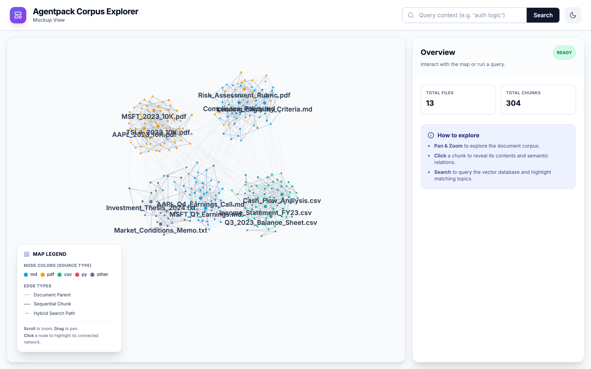
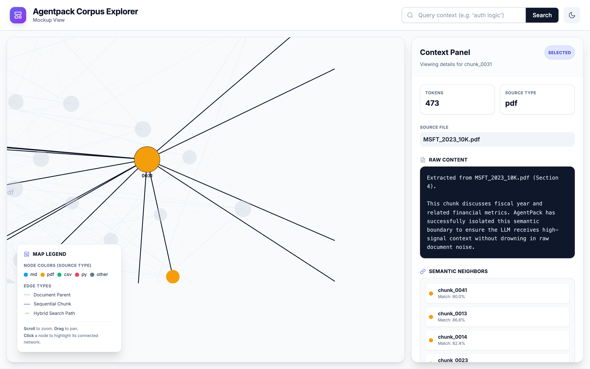
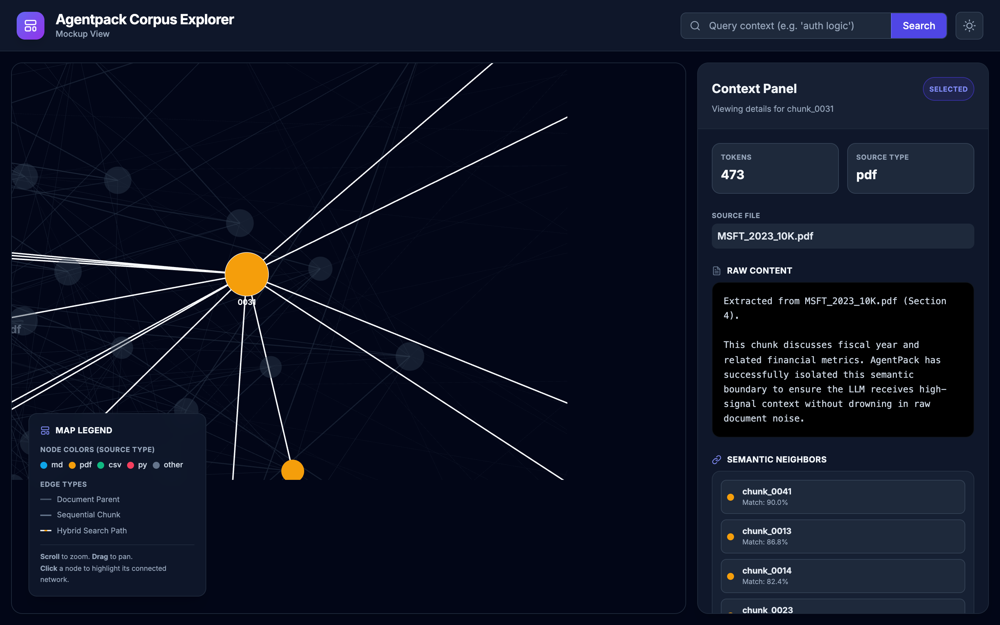

# AgentPack Corpus Explorer

The **AgentPack Corpus Explorer** is a local, interactive web application that allows you to visually audit, explore, and debug your compiled context packs before handing them off to an LLM.

Instead of staring at massive JSON lines files, the Corpus Explorer turns your vector database into a holistic, interactive universe.


*Get a bird's-eye view of your entire processed knowledge base.*

## Why use the Corpus Explorer?
When you compile a folder of unstructured documents into an AgentPack, the CLI performs semantic chunking, embeds the text, and links chunks based on sequence and semantics.

The UI helps you answer critical questions:
- Are my chunks too large or too small?
- Is my hybrid search retrieving the correct evidence for my query?
- How are different files semantically related to each other?

## Installation
The UI requires additional dependencies (like FastAPI and Uvicorn). You can install them by using the `[ui]` extra:

```bash
pip install "agent-context-packager[ui]"
```

## Running the Explorer
After compiling a pack, launch the explorer by pointing it to your output directory:

```bash
agentpack ui ./agentpack-output --port 8000
```
Then open `http://localhost:8000` in your browser.

## Key Features

### Holistic Corpus Explorer Map
Powered by a 2D force-graph canvas, the map renders the corpus as document nodes plus chunk nodes.
- **Dynamic Node Sizing:** As you zoom in, the nodes adjust their size to keep the interface clean.
- **Progressive Labels:** Document labels are always visible, and chunk labels appear when you zoom in or select a node.

### Interactive Hybrid Search
The UI hooks directly into the AgentPack SQLite FTS5 + FastEmbed vector engine.
- Type a query into the search bar.
- The UI will instantly dim non-matching chunks.
- Matching chunks will glow amber, and the UI will draw dashed links between the ranked results so you can inspect the returned set at a glance.


*Test your RAG queries instantly and see the semantic paths the vector engine took to find them.*

### Context Sidebar
When you click on a chunk, the right-hand panel instantly updates to show:
- The raw Markdown/Text content of the chunk.
- Token counts and source file metadata.
- A live calculation of **Semantic Neighbors**, allowing you to click through and explore semantically similar chunks across entirely different documents.


*Click any chunk to inspect its exact boundaries, raw text content, and nearest semantic neighbors.*

### Onboarding
The UI comes with an interactive Shepherd.js onboarding tour to guide you through your first time exploring the corpus.

### Built-in Dark Mode
A sleek, low-strain dark interface perfectly designed for late-night prompt engineering and context debugging.


